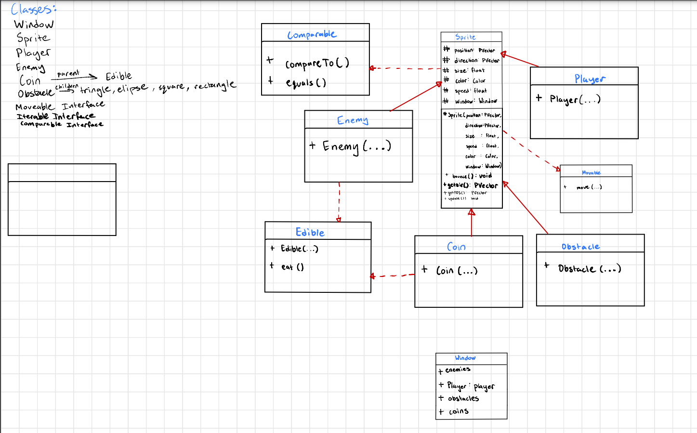
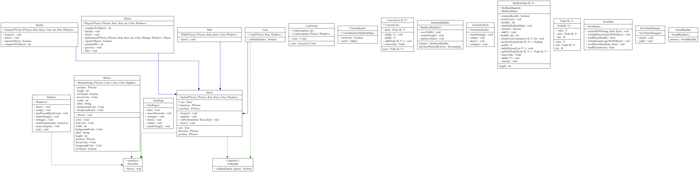

# Java Platform Game using Processing.org Library

This is a Java platform game developed by our team using Processing.org library. The game showcases our ability to use different data structures and design patterns. The objective of the game is to navigate the player through various obstacles and enemies to reach the end goal.

## Setup
To run the game, make sure you have Processing.org library installed on your system. You can run the game by running the main() method in the Window class.
An easier way is just to pull this github repo and it will include everything necessary. You may have trouble with environment variables, which we included in the repo. 
See the troubleshooting at the bottom. 

## Features
The game has the following features:

* A player that can be controlled using the arrow/spacebar keys
* Enemies that move in random directions and can damage the player.
* Coins that the player can collect for points.
* Health system for the player.
* Score and coin counter.

## Code
* The Window class is the main class that manages everything visible in the game. It extends the PApplet class from the Processing.org library and implements the Drawable interface.
* The game uses various data structures such as MyHashMap(a custom hashmap) and ArrayList to manage sprites, enemies and coins.
* Design patterns used in the game include the Singleton pattern for the player instance.
* The game can be controlled using the arrow keys or spacebar to make the player jump.

## Credits
This game was developed by our team including Bhavnoor Saroya, Yuvraaj Chouhan, Gurtej Malik, Youngwon Kim, Leo Lastname.

# Initial Project Pitch from beginning of term:
## Project Pitch

### One-Liner:
Recreate a Geometry Dash style 3d platformer game with various shapes and objects.

### Requirements:
#### - Requirement 1:
We could import some Processing.org libraries in order to implement an interface for user interaction features throughout our project.
**We did, our game functions Entirely with Processing.org**
#### - Requirement 2:
At regular intervals, the user's progress will be saved or "pushed".
**Another success, user progress is saved to mongoDB and we can also see top players in the console after we lose the game**
#### - Requirement 3:
This is included with Requirement 2, the user's progress at regular intervals in the game with a JSON file.
**Yep! We can read and write Json files for anything we want, we are storing player health and score!**
#### - Requirement 4:
A collection of platforms, and objects posing as obstacles which are "spawned" and "deleted" based on user position
maintained by data.
**Our enemies are managed by a custom hashmap which is able to utilize o(1) lookup times and remove enemies after they go out of view.**
#### - Requirement 5:
- We can document progress as we go through working on the project.
- We make sure our project is complete on final submission day.
- Make sure there are no errors in project before submission.

**At the time of writing, the project works good, all systems go, we used issues and we made many comments along the way**

## Communication, and Roles:
### - Communication:
- We communicate within our group using a Discord group chat.
- We will hold one meeting outside of class time on Tuesdays at 2pm, every week.
- We will have an ongoing minutes document where we record attendance and group decisions.

**Mission success, sort of, we did good, perhaps could have been slightly better in terms of communication.**

### - Roles:
## - Architect: Yuvraaj Chouhan
#### Project Pitch:
My responsibilities as an architect is to manage the Enemy and Player classes. In detail, I will manage how the
Enemy class will create obstacles with different sizes at different positions. My management for the Player class will
include how to select Player appearance, etc. With each upgrade in score, Player's appearance (eg: color, size etc.) would change indicating a bump or drop in the score.

## - Test Maker: Leo
#### Project Pitch:
Making tests is what I'm responsible for. When one of our group members creates classes or functions,
I test every scenario and make sure the output matches what we anticipate.

## - UI/UX lead: Won
#### Project Pitch: 
I am responsible for all the visible stuffs in our projects. I will help my teammates
to keep track of what I intended and what it should be in terms of UX/UI.

## - Backend + Async + data structures: Bhavnoor Saroya
#### Project Pitch:
I'll handle database calls, will handle enemy class alongside Gurtej and fill in gaps as necessary. additionally I will take on the reponsibility of handling map refresh. Regen map elements based on how far player has reached. I likely will also contribute to data structures, and fill in anywhere else that my help is needed.

## - Scoring/Backend: Gurtej
#### Project Pitch: 
My responsibilities as the backend manager would be to create data structures that store properties of different types of enemies, accessories granted to Player upon upgrades and the data of the Player as well. As the score keeper, I would update the score and 'health' whenever the Player hits an Enemy or passes a level in the data structure.

# Initial UML

# Final UML
You may want to download this to properly read it.

# Troubleshooting
### Having trouble? We're here to help, some things to check:

* Check that your run config(which should load automatically) has an environment variable (the MONGO_KEY) if for some reason it didn't work. you can add it manually, or just type it into the ide, the password is "SuperSecretPassword" without the quotes of course.
* Help! when I run the game I can't see anything! No problem if you're running Window, try running startpage, or vice versa. 
* My computer crashed! We can't help you here, check your ide is up to date and your specs are from this decade.

## Technical Project Requirements

The minimum requirements for the project are outlined here to give you a starting point. Meeting the minimum requirements alone will not guarantee you a good mark. You are welcome to meet and exceed the minimum requirements if you have good, creative ideas and would like to discuss them with me.

**Requirement 1**: The project must incorporate some visual interface using Processing.org libraries. All user interaction must be conducted via this interface.

**Requirement 2**: The project must incorporate some kind of non-blocking concurrent/asynchronous processing that happens at regular intervals. For example, you might push or fetch data from in the background.

**Requirement 3**: The project must incorporate some kind of non-trivial persistent data state that must be read, processed, and written at regular intervals. For example, you might save a game state in a JSON file. This may or may not be included with Requirement 2.

**Requirement 4**: The project must incorporate some kind of self-managing custom iterable data structure. For example, you might have a collection of enemies that are added and deleted based on statistics maintained by the data structure.

**Requirement 5**: The project must be well-documented, complete, and run without errors on final submission.

## Project Pitch (group, 1%)

The project pitch will be a short document that describes the kind of interactive application you would like to create with your group. The project pitch must include the following items:

*One-liner*: One-sentence description of your project.
*Outline*: 1-10 sentences that describe how your project will fulfill the project requirements.
*Communication policies*: A description of how your group will meet, communicate, and make decisions (as per Lab 03).
*Roles and responsibilities*: A description of each team member's jobs in the group.
*Milestones*: A rough outline of the major project milestones that you expect to complete and your own estimated timeline. This can and will change, so do your best to estimate and plan for the milestones to change.

Draft was due today, final due next lab. Submission here, on GitHub. Make a `.md` file that outlines the above.

## Initial UML Diagrams (group, 1%)

The initial UML diagrams will outline the class structure that your group will follow for the first milestone of the project. It must include the following items all classes that will be created by the group and important descriptive interfaces from either the Java library or created by the group. I expect that this will change significantly throughout the project, so it does not have to be perfect but it should be a best effort attempt. This is because you will use this to communicate with your group members about what to make. Therefore, the diagram should be *sufficiently complex* to give you a term's worth of work.

Draft due next Lab, final due two labs from now. Submission here, on GitHub. Suggestion is to use a tool like [draw.io](https://app.diagrams.net/) but you may use whatever tool is most useful for you.

## Initial GitHub Issues (group, 1%)

The initial GitHub issues will be the tasks that are assigned to each of your group members at the beginning of the project. Every team member should have at least five issues to start (20-30 total). You will have to decide within your group how granular you want to make these issues. 

Issues will be tracked here, on GitHub.

## Final Project Demo (group, 1%)

The Final Project Demo will be a working version of your project that you will present to your lab section for review. The demo will be in lab, and will include a live demo of the working application, and a short code review. There are no slides required, but you should have practiced your demo to make sure it will run reasonably well. This will be during the last lab of class.

No submission.

## Final README.md (group, 1%)

The Final README.md must give instructions on how to run your program, a list of contributions by each member, and any references/citations for code you may have used from elsewhere. 

Submission is here, on GitHub, in the `README.md` file.

## Final Product (group, 5%)

The Final Product will be evaluated for overall code design and documentation and evaluated on the same design principles as individual contributions. If you are below the 1000 line minimum contribution, your mark will be scaled down for this portion.

Submission is here, on GitHub.

## Code Contributions (individual, 15%)

You will be expected to take on a significant individual contribution to the group project (at least 1000 lines of non-trivial code). It may be in a number of forms, but here are some examples:

**Architect**: you are in charge of the high-level code structuring and organizing.

**Test maker**: you are in charge of test coverage that supports other group members.

**UI/UX lead**: you design and implement the user interface.

**Backend**: you design and implement the data structures.

**…??**: Make up your own depending on your use case, i.e., collision system designer, animation architect, async code wrangler.

Contributions must be for functional, working Java code and must be continuous throughout the term. You may not, for example, push all of your changes at the end of term. Code will be marked on following good design principles, i.e., SOLID, design patterns, etc. You are encouraged to work together and use pair programming for components, but you will be marked on your contribution to your own modules individually.

## Documentation Contributions (individual, 5%)

Your code must be well-documented with fully-formed method signatures, comments, and necessary README or Wiki pages. This is further broken down into the following.

### Initial individual pitch (1%)
A description of your individual feature that you plan to implement. 

Due date TBD.

### Initial individual UML Diagrams (1%)
Any combination of sequence, communcation, or class diagrams that describe your feature's initial planned abilities. 

Due date TBD.

### Documentation contributions (3%)
Your personal feature documentation, wherever it happens to show up in the final documentation.

Due with final submission.

## Issues and Pull Request Contributions (individual, 5%)
You must track your own work in the form of creating and closing GitHub issues, creating and reviewing pull requests, responding to issues that have been assigned to you, and creating issues that you assign to others (all within reason).

# Errata
The project MUST be managed here, in this GitHub repo. Nothing that happens outside of this GitHub repo will be trackable by me, therefore, it will not be marked or considered for marking.

You must use the following branching structures:
- `main` branch must always be working, tested, debugged, human-readable code.
- `<initals>_<issue #>_<optional description>` is the format for each ISSUE that you're working on. It should always be a branch off of `main`.
- Every individual branch must regularly merge `main`, and it should be no more than a few days before your branch is either merged into `main` or deleted.

You must use pull requests to manage your code integration:
- make your branch from `main`, e.g., `git checkout -b pb_71_demo`
- make your commits, e.g., `git add .` and `git commit -m "fixed issue 71 by reloading gradle for the 100th time"` and `git push origin pb_71_demo`.
- merge `main` into your branch, and NOT the other way around. E.g., `git merge main`. YOU fix all the merge conflicts or problems that arise. Commit and push again.
- go to GitHub.com and make a pull request
- one other person (NOT YOU) needs to review the code and either approve or reject your changes with detailed line-by-line comments.
- If needed, make the requested fixes and commit and push again.
- the other person (NOT YOU) will merge your PR into `main`
- the other person (NOT YOU) will delete your branch

